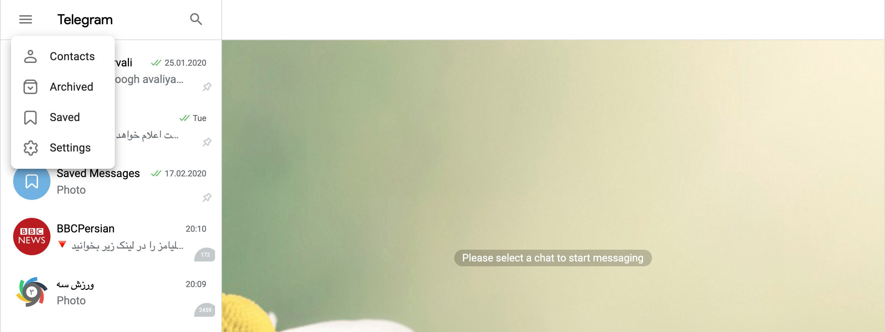

# Telegram Web App

>This project is the output of 3-4 days hard working for the DK interview test. It's based on [Telegram Database Library](https://github.com/tdlib/td) for signing in old telegram users and creating new telegram accounts based on a valid phone number exactly as like as Telegram.

### Some fact about this project

- Due to the lack of time, part of the work is duplicated from the Telegram web app and it's just got a bit refactored and styled into something new.
- There are plenty of bugs and warnings in this project right now and it could be gone, if there were some more days on this project.

### Here are some screenshots

      

### Running locally
Install [node.js](http://nodejs.org/).

Install dependencies with:

```lang=bash
npm install
or
yarn install
```

This will install all the needed dependencies.

-----
All TDLib files will be installed into node_modules/tdweb/dist/ folder. Manually copy them into the public folder with:

#### **Do one of the following based on your OS**

If you are using UNIX based OS do the following:
```lang=bash
cp node_modules/tdweb/dist/* public/
```
If you are using Windows do the following:
```
copy Full path to project node_modules\node_modules\tdweb\dist\*  Full path to project public directory\public\
```

---------
Run the app in development mode with:

```lang=bash
npm run start
or
yarn start
```

Open http://localhost:3000 to view it in the browser.
